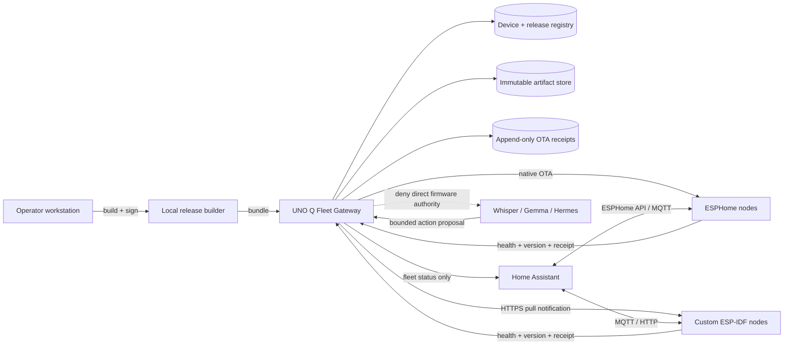

# Local Physical AI Fleet + Safe Wi-Fi OTA Design

**Status:** Design approved for implementation planning; hardware identities and flash capacities still require inventory.

**Goal:** Build a local-first voice-and-sensing fleet in which every ESP32/ESP32-S3 node can receive authenticated Wi-Fi firmware and configuration updates, recover automatically from a bad release, and emit a receipt linking the requested, installed, booted, and accepted versions.

**System:** 3× ESP32-S3 voice/display nodes, 1× ESP32 temperature/humidity/OLED node, Arduino UNO Q 4GB, Home Assistant, and a local GPU/agent host.

**Core decision:** Home Assistant/ESPHome owns normal device integration, while the UNO Q owns fleet inventory, release policy, artifact serving, staged rollout, and receipt collection. Custom firmware uses Espressif A/B OTA semantics. ESPHome firmware uses native ESPHome OTA with safe mode and ESP-IDF automatic rollback. Neither path accepts an unsigned release or a direct LLM-issued update.

---

## 1. System architecture



### Authority split

| Component | Owns | Must not own |
|---|---|---|
| ESP32/S3 node | Sensors, wake word, local UI, health report, A/B boot acceptance | Release selection, signing keys, unrestricted actuation |
| Home Assistant | Device state, Assist sessions, automations, operator dashboard | Firmware signing, arbitrary shell, canonical OTA receipts |
| UNO Q | Device registry, artifacts, rollout policy, receipts, update scheduling | Building releases from untrusted source, autonomous dangerous actions |
| Builder laptop | Reproducible build, tests, manifest generation, offline signing | Silent fleet-wide deployment |
| Gemma/Hermes | Explanations and optional update proposals | Signing, bypassing rollout gates, raw firmware upload |

The update control plane is independent of the voice/data plane. Voice failures must not block OTA recovery, and OTA activity must stop microphone streaming and servo movement before installation.

---

## 2. Node allocation

| Logical ID | Initial role | Preferred firmware | OTA lane |
|---|---|---|---|
| `voice-s3-01` | First/canary voice satellite | ESPHome, ESP-IDF framework | ESPHome native OTA + safe mode + rollback |
| `voice-s3-02` | Second room voice satellite | ESPHome, ESP-IDF framework | Same after canary passes |
| `voice-s3-03` | Third room or development spare | ESPHome or custom ESP-IDF | Last production cohort / recovery spare |
| `env-esp32-01` | DHT + SSD1306 room node | Existing custom firmware, migrated to ESP-IDF A/B OTA | Signed pull OTA |
| `uno-q-gateway-01` | Fleet/policy/receipt gateway | Debian service bundle | Atomic service release, independent of node OTA |

Do not assign flash layouts until each board reports chip, flash capacity, PSRAM, MAC, board model, built-in RGB LED pin/type/color order, current partition table, and image size. Voice firmware can be substantially larger than sensor firmware.

### 2.1 Physical identity colors

A true built-in addressable RGB LED can mix colors beyond red, green, and blue. Assign the preferred identity colors:

| Node | Identity | RGB target | Hex | Role |
|---|---|---:|---:|---|
| `voice-s3-01` | Purple | `(128, 0, 255)` | `#8000FF` | First/canary satellite |
| `voice-s3-02` | Orange | `(255, 64, 0)` | `#FF4000` | Second satellite |
| `voice-s3-03` | Pink | `(255, 0, 96)` | `#FF0060` | Third/development satellite |

These values are logical RGB. Inventory must detect whether the physical LED expects RGB, GRB, or another byte order and must identify its actual GPIO; board definitions and `RGB_BUILTIN` values are not assumed interchangeable.

Identity behavior:

- At normal idle, show the assigned color continuously at 5% brightness.
- During identification, pulse the assigned color between 5% and 20% for 10 seconds.
- During listening, use a faster pulse of the assigned hue rather than replacing it with a generic color.
- During OTA download, use a slow pulse; during verification, double-pulse; during reboot, turn off briefly.
- On a recoverable fault, alternate the assigned hue with red. On rollback, blink red three times, then return to the assigned hue on the recovered firmware.
- Physical microphone mute takes precedence: keep the identity hue but flash a short amber marker periodically, while the display shows `MUTED`.
- Cap normal brightness at 20% to avoid glare and unnecessary power draw. A temporary manufacturing test may use higher brightness.
- Save `identity_color`, calibrated channel order, LED GPIO, and brightness cap in the hardware profile. Identity must survive firmware and configuration updates.

If a board proves to have only a single-color LED rather than an addressable RGB device, fall back to distinct blink identities: one pulse, two pulses, and three pulses. Do not guess the pin and risk driving a boot strap or peripheral line.

---

## 3. OTA mechanisms

### 3.1 ESPHome voice satellites

Use ESPHome with `framework.type: esp-idf`, not the Arduino framework, for the voice satellites. Enable:

- ESPHome native OTA with a unique per-node OTA password stored in Home Assistant/ESPHome secrets.
- API encryption with a unique per-node key.
- `safe_mode`, leaving network, serial logging, and OTA available when application components fail.
- ESP-IDF automatic application rollback, with boot accepted only after the node passes its health checks.
- A physical or GPIO-triggered safe-mode path where the board permits it.
- Visible update state on the display: `DOWNLOADING`, `VERIFYING`, `REBOOTING`, `ROLLBACK`, `HEALTHY`.

ESPHome 2026.1 added ESP-IDF automatic OTA rollback enabled by default. ESPHome safe mode disables normal components while retaining networking and OTA. Pin the tested ESPHome version in release metadata; never rely on an unrecorded rolling version.

Representative configuration shape—not a board pinout:

```yaml
esphome:
  name: voice-s3-01
  project:
    name: recursiveintell.voice-satellite
    version: "0.1.0"

esp32:
  board: REPLACE_AFTER_INVENTORY
  framework:
    type: esp-idf

api:
  encryption:
    key: !secret voice_s3_01_api_key

ota:
  - platform: esphome
    password: !secret voice_s3_01_ota_password

safe_mode:
  boot_is_good_after: 60s
  num_attempts: 3
  reboot_timeout: 10min
```

Exact options must be validated against the installed ESPHome schema before flashing.

### 3.2 Custom sensor/display firmware

The existing `esp32-sensor-hub` PlatformIO Arduino firmware should not use unauthenticated `ArduinoOTA` as the fleet foundation. Migrate the production image to ESP-IDF, or Arduino-as-an-ESP-IDF-component, with:

- Two application slots: `ota_0` and `ota_1`.
- `otadata`, NVS, and a small persistent receipt/config partition.
- HTTPS artifact download from the UNO Q.
- Manifest signature verification before download authorization.
- SHA-256 verification of received bytes before boot selection.
- Bootloader rollback enabled.
- `esp_ota_mark_app_valid_cancel_rollback()` only after the health contract passes.
- Automatic rollback when the candidate crashes, watchdog-resets, or never marks itself valid.
- Recovery by USB serial as the final fallback.

The node never installs an arbitrary URL. It receives a release ID, retrieves a signed manifest from its pinned gateway, verifies that the target matches its immutable hardware profile, and then downloads the digest-addressed artifact.

### 3.3 Configuration and model updates

Separate firmware from mutable data:

1. **Firmware OTA:** executable image; A/B slots; signed; reboot required.
2. **Configuration update:** sensor thresholds, room label, display layout, wake-word selection; schema-validated; atomic write; no executable scripts.
3. **Model/data update:** wake-word or TinyML model; signed digest; stored in a dedicated A/B data partition when size permits.

A configuration or model update must not masquerade as firmware. Each has a distinct artifact type, schema, authorization policy, and receipt.

---

## 4. Flash-layout profiles

Select after live inventory and compiled-image sizing.

### Profile A: minimum 4 MB sensor node

- NVS and PHY partitions.
- `otadata`.
- Two application slots sized from measured release binaries plus at least 20% headroom.
- Small filesystem/receipt partition only if capacity remains.
- No large local voice model.

If two safe application slots cannot fit, do not enable remote production OTA. Keep that board USB-flashed or reduce the image. Never trade away rollback merely to fit features.

### Profile B: 8 MB node

- Two generous application slots.
- A/B configuration/model partitions.
- Local crash/boot receipt ring buffer.
- Recovery image if supported by the selected framework layout.

### Profile C: 16 MB ESP32-S3 voice node

- Two voice-firmware slots.
- A/B wake-word/model data.
- Bounded diagnostic ring buffer.
- Optional factory recovery image when the validated ESPHome/bootloader path supports it.

Partition CSV and compiled sizes become release evidence. The release builder rejects images whose slot utilization exceeds the configured ceiling.

---

## 5. Fleet gateway on UNO Q

### Services

```text
/opt/ri-fleet/
├── app/                       # versioned fleet service releases
├── current -> app/releases/X  # atomic symlink
├── artifacts/sha256/          # immutable firmware/config/model blobs
├── manifests/                 # signed release manifests
├── registry/devices.yaml      # device identity and cohort
├── registry/releases.jsonl    # immutable release announcements
├── receipts/ota.jsonl         # canonical update receipts
├── state/fleet.sqlite3        # query/index state, rebuildable from logs
└── keys/trusted-signers/       # public keys only
```

The private signing key does not live on the UNO Q. It stays on the operator workstation or hardware token. The UNO Q stores public verification keys and serves only verified bundles.

### Local API

| Method | Path | Purpose |
|---|---|---|
| `GET` | `/v1/health` | Gateway health and version |
| `GET` | `/v1/devices` | Fleet inventory and last-seen status |
| `POST` | `/v1/devices/register` | Bootstrap registration requiring operator-issued enrollment token |
| `GET` | `/v1/devices/{id}/desired` | Desired release/config for authenticated node |
| `GET` | `/v1/releases/{id}/manifest` | Signed manifest |
| `GET` | `/v1/artifacts/sha256/{digest}` | Immutable artifact bytes |
| `POST` | `/v1/receipts` | Node boot/install/rollback receipts |
| `POST` | `/v1/rollouts` | Operator-authorized rollout creation |
| `POST` | `/v1/rollouts/{id}/pause` | Immediate rollout stop |
| `POST` | `/v1/rollouts/{id}/rollback` | Set prior accepted release as desired |

Use TLS on the LAN. If a private CA is initially too costly, pin the gateway certificate/public key on each custom node and isolate the OTA VLAN; do not silently fall back to plaintext HTTP for firmware.

### Protocol choice

- ESPHome nodes are pushed using ESPHome's native OTA tooling from the UNO Q worker.
- Custom nodes poll `desired` with jitter and pull signed artifacts over HTTPS.
- MQTT may announce `update_available`, but it is only a hint; the authenticated HTTPS desired-state response is authoritative.
- Home Assistant displays fleet state but does not become the canonical artifact server.

---

## 6. Identity, authentication, and signing

### Device identity

Each node receives during USB enrollment:

- Stable logical `device_id`.
- Hardware profile ID.
- Chip MAC and optional eFuse identity evidence.
- Per-device API/OTA credential.
- Gateway trust anchor.
- Initial accepted firmware digest.

Do not use MAC address alone as authentication.

### Release signing

Use Ed25519 release signatures at the manifest layer. The manifest contains the SHA-256 of every artifact. Espressif Secure Boot signing is an additional device-level layer, not a replacement for fleet manifest signing.

For a later hardened deployment:

- Enable Secure Boot v2.
- Enable flash encryption where threat model and recovery procedures justify it.
- Burn eFuses only after USB recovery, signed OTA, rollback, and key backup have been tested on a sacrificial board.
- Add anti-rollback secure-version counters only after the release process is stable; eFuse counters are irreversible.

Development phase uses signed manifests and rollback without irreversible eFuse changes.

### Example release manifest

```json
{
  "schema": "ri_fleet_release_manifest_v1",
  "release_id": "voice-s3-0.1.3",
  "artifact_type": "firmware",
  "target": {
    "hardware_profile": "esp32s3-voice-n16r8-v1",
    "firmware_family": "ri-voice-satellite",
    "min_bootloader": "1"
  },
  "version": "0.1.3",
  "build": {
    "source_commit": "REQUIRED",
    "toolchain": "PINNED",
    "framework": "esphome/esp-idf",
    "reproducible": false
  },
  "artifact": {
    "sha256": "REQUIRED_64_HEX",
    "size_bytes": 0,
    "url_path": "/v1/artifacts/sha256/REQUIRED_64_HEX"
  },
  "policy": {
    "minimum_battery_pct": null,
    "requires_external_power": true,
    "health_timeout_s": 120,
    "rollback_on_failure": true
  },
  "created_at": "RFC3339",
  "signer_key_id": "operator-release-01",
  "signature_ed25519": "BASE64"
}
```

The signature covers canonical JSON bytes excluding the signature field. Canonicalization rules must be versioned and tested with cross-language golden fixtures.

---

## 7. OTA state machine

```text
IDLE
  -> OFFERED
  -> MANIFEST_VERIFIED
  -> PRECHECK_PASSED
  -> DOWNLOADING
  -> ARTIFACT_VERIFIED
  -> STAGED
  -> REBOOTING
  -> CANDIDATE_BOOT
  -> HEALTH_CHECKING
  -> ACCEPTED

Any verification failure -> REJECTED
Download interruption     -> IDLE on old image
Candidate crash/timeout   -> BOOTLOADER_ROLLBACK -> ROLLED_BACK
Operator stop             -> PAUSED before reboot
```

### Node prechecks

Before changing flash:

- Correct hardware and firmware family.
- Signature and artifact digest valid.
- New version permitted by rollout policy.
- External power present for voice nodes; sensor node has stable supply.
- Free OTA slot large enough.
- No active voice session.
- Servos moved to neutral and detached or power-disabled.
- Latest sensor/receipt queue persisted.
- Gateway reachable and time sufficiently synchronized for receipt ordering.

### Health contract

A candidate image is marked valid only after all required checks pass:

- Boot count is one and reset reason is allowed.
- Main task survives for the configured stabilization period.
- Wi-Fi reconnects.
- Gateway authentication succeeds.
- Device reports matching running version and digest.
- Required peripherals initialize: microphone/display for voice profile; DHT/display for environment profile, with explicit degraded policy for optional hardware.
- Home Assistant API/MQTT registration succeeds where required.
- Watchdog has not fired.
- A signed/linked `candidate_healthy` receipt reaches the UNO Q.

A model response or LLM judgment is never part of boot acceptance.

---

## 8. Rollout policy

### Cohorts

1. **Development:** `voice-s3-03` or a dedicated spare, manually recoverable over USB.
2. **Canary:** `voice-s3-01`, one real-room node.
3. **Voice cohort:** remaining S3 satellites, one at a time.
4. **Sensor cohort:** regular ESP32 after its own image has been verified.

Never update every node simultaneously. At least one working voice/display endpoint remains online.

### Promotion gates

A release progresses only when:

- Local build and tests pass.
- USB flash smoke test passes on the development board.
- OTA update from prior accepted version passes.
- Forced bad-health test demonstrates automatic rollback.
- Power-loss-during-download test leaves the old image bootable.
- Canary remains healthy through a defined observation window.
- No unexplained reset, audio regression, sensor regression, or receipt gap appears.
- Operator explicitly promotes the release to the next cohort.

### Immediate pause triggers

- Any boot loop or rollback.
- Two consecutive update failures.
- Missing post-boot receipt.
- Peripheral loss on a required profile.
- Home Assistant disappearance.
- Artifact or manifest digest mismatch.
- Gateway storage low-water mark reached.

---

## 9. Receipt chain

Use append-only JSONL on nodes (bounded ring) and UNO Q (durable), with canonical IDs and digest backpointers.

Required events:

1. `release_built`
2. `release_signed`
3. `release_admitted`
4. `rollout_authorized`
5. `update_offered`
6. `manifest_verified` or `manifest_rejected`
7. `artifact_downloaded`
8. `artifact_verified`
9. `candidate_booted`
10. `candidate_healthy` and `release_accepted`, or `rollback_observed`
11. `rollout_completed`, `paused`, or `failed`

Example node receipt:

```json
{
  "schema": "ri_fleet_ota_receipt_v1",
  "receipt_id": "CONTENT_DERIVED_ID",
  "device_id": "voice-s3-01",
  "event": "release_accepted",
  "release_id": "voice-s3-0.1.3",
  "previous_sha256": "OLD_DIGEST",
  "candidate_sha256": "NEW_DIGEST",
  "running_sha256": "NEW_DIGEST",
  "boot_slot": "ota_1",
  "reset_reason": "software_reset",
  "health": {
    "wifi": true,
    "gateway": true,
    "required_peripherals": true,
    "uptime_ms": 60000
  },
  "observed_at": "RFC3339_OR_MONOTONIC_WITH_GATEWAY_TIME",
  "previous_receipt_digest": "DIGEST"
}
```

The query database is an index, not the source of truth. It must be rebuildable from immutable manifests, release announcements, and receipt logs.

---

## 10. Home Assistant experience

Expose read-oriented entities:

- Running firmware version.
- Desired firmware version.
- Assigned identity color and current LED state.
- Update availability.
- Last successful update.
- Last rollback/failure.
- Update state and progress.
- Last receipt ID.
- Node online/healthy/degraded.
- Physical microphone mute state.

Expose buttons only to trusted administrators:

- `check_for_update`
- `update_canary`
- `pause_rollout`
- `rollback_canary`
- `identify_node`

Do not expose `update_all` to the LLM conversation agent. Home Assistant automation may notify that updates exist, but promotion remains an explicit operator action.

---

## 11. UNO Q self-update

The UNO Q cannot safely update the fleet if its own service update is non-atomic.

Use versioned application directories plus an atomic `current` symlink:

1. Verify signed service bundle.
2. Unpack into a new immutable release directory.
3. Run offline migrations against a copied/index database.
4. Run service self-tests on a temporary port.
5. Atomically switch `current`.
6. Restart the systemd unit.
7. Health-check.
8. Revert symlink automatically if health fails.

Keep artifact and receipt stores outside the application release directory. Back them up before schema migrations. OS upgrades remain a separate, operator-controlled Debian maintenance lane; do not combine them with ESP fleet rollouts.

---

## 12. Network design

Recommended local segmentation:

```text
Management VLAN/LAN: laptop, Home Assistant, UNO Q
IoT VLAN/LAN: ESP32 nodes
GPU host: reachable only on required inference ports
Internet: not required for runtime OTA
```

Firewall policy:

- Nodes -> UNO Q: HTTPS desired/artifact/receipt endpoints; MQTT if used.
- UNO Q -> ESPHome nodes: native OTA and API ports only.
- Nodes -> Home Assistant: ESPHome API/MQTT as selected.
- Nodes -> Internet: denied by default.
- Inbound WAN -> any node/UNO Q: denied.
- LLM host -> OTA API: read fleet status and create proposal only; no rollout authorization token.

Artifact caching makes updates work when the internet is down. Internet retrieval, when needed, happens on the builder/operator side, followed by local verification and admission.

---

## 13. Failure and recovery matrix

| Failure | Expected behavior | Recovery |
|---|---|---|
| Wi-Fi drops during download | Old image remains active | Retry with bounded backoff |
| Power loss during download | Old image boots | Retry after stable power |
| Power loss after staging | Bootloader selects valid metadata state | Automatic old-image boot or candidate evaluation |
| Candidate crashes | Rollback to prior accepted slot | Fleet pauses cohort |
| Candidate has no Wi-Fi | Health timeout and rollback | Safe-mode/native OTA or USB |
| Wrong board artifact | Manifest target check rejects | Correct release targeting |
| Bad signature/digest | Reject without flash activation | Security receipt + alert |
| UNO Q unavailable | Nodes continue current firmware and local functions | Restore gateway; no forced update |
| Home Assistant unavailable | OTA control plane still works | Restore HA independently |
| Both app slots invalid | Recovery/factory image if designed; otherwise USB | Physical recovery |
| Credential compromised | Revoke node credential and re-enroll by USB | Rotate per-device secret |

Every node remains physically accessible during early rollout testing. OTA reduces routine USB flashing; it does not eliminate the need for a recovery path.

---

## 14. Implementation sequence

### Phase 0 — inventory and identity

- Capture USB serial identity, MAC, chip revision, flash/PSRAM size, board model, current partition table, and image size for all four ESP boards.
- Print and save a device-to-logical-ID mapping.
- Select a sacrificial/development S3.

**Gate:** No two boards share a logical ID or credential; every proposed partition layout fits measured flash.

### Phase 1 — ESPHome canary OTA

- Build one S3 microphone/display satellite with pinned ESPHome and ESP-IDF.
- Configure API encryption, per-node OTA password, safe mode, rollback, and visible update state.
- Prove USB flash, successful OTA, forced rollback, and safe-mode recovery.

**Gate:** Prior firmware returns automatically after a deliberately unhealthy candidate.

### Phase 2 — UNO Q artifact and receipt service

- Implement immutable artifact storage, signed-manifest admission, device registry, desired state, and receipt ingestion.
- Keep private signing keys off the UNO Q.
- Add systemd service and atomic self-update layout.

**Gate:** Tampered manifest and tampered artifact are rejected; receipts survive restart.

### Phase 3 — custom ESP32 signed pull OTA

- Add A/B partitions and rollback to `esp32-sensor-hub` production firmware.
- Add pinned-gateway HTTPS, manifest verification, digest verification, health contract, and receipts.
- Preserve existing DHT/OLED/sensor-policy behavior.

**Gate:** Existing firmware tests/builds pass; prior-version-to-new-version OTA and automatic rollback pass on hardware.

### Phase 4 — fleet orchestration

- Add cohorts, canary-first rollout, pause/rollback, concurrency limit of one, and Home Assistant status entities.
- Add update blackout while voice or physical action sessions are active.

**Gate:** A four-node simulated fleet and at least two physical nodes complete a staged rollout without simultaneous downtime.

### Phase 5 — hardening

- Add TLS trust rotation and credential revocation.
- Add signed config/model artifacts with separate schemas.
- Run power-loss, network-loss, disk-full, corrupted-artifact, and gateway-restart fault injection.
- Consider Secure Boot v2 and flash encryption only after recovery is repeatedly proven.

**Gate:** Fault matrix is receipt-backed; no irreversible eFuse operation occurs during development validation.

---

## 15. Acceptance proof

The complete demonstration is:

```text
sensor observed
-> sensor receipt reaches UNO Q
-> Home Assistant/Gemma routes an explanation
-> response reaches ESP32 display
-> operator admits a signed firmware update
-> UNO Q offers it to the canary
-> node verifies, stages, and reboots
-> node passes peripheral/network health
-> bootloader accepts candidate
-> final OTA receipt links old version, manifest, artifact digest, boot slot, health, and new version
```

Then deliberately deploy an unhealthy test candidate:

```text
candidate boots
-> health contract fails
-> bootloader rolls back
-> old firmware reconnects
-> UNO Q records rollback
-> rollout automatically pauses
-> Home Assistant alerts the operator
```

Both paths are required. A successful upload alone does not prove safe OTA.

---

## 16. Hard boundaries

- No firmware updates from arbitrary internet URLs.
- No shared fleet-wide OTA password.
- No unsigned or digest-unverified images.
- No LLM authority to sign, admit, promote, or fleet-deploy releases.
- No fleet-wide first deployment; canary first, one node at a time.
- No update while a servo is energized or a voice session is active.
- No irreversible Secure Boot/flash-encryption eFuse changes until recovery is tested and keys are backed up.
- No claim of production readiness, certification, or autonomous control from a lab proof.

---

## 17. Source anchors

- Existing hardware/use-case analysis: `/home/sikmindz/projects/esp32-reusable/EXPANDED_HARDWARE_STACK_USE_CASES_2026-06-30.md`
- Existing sensor firmware: `/home/sikmindz/projects/esp32-sensor-hub`
- Existing tiered stack: `/home/sikmindz/projects/tiered-edge-ai`
- Home Assistant local voice: <https://www.home-assistant.io/voice_control/voice_remote_local_assistant/>
- ESPHome OTA: <https://esphome.io/components/ota/esphome/>
- ESPHome safe mode: <https://esphome.io/components/safe_mode/>
- ESPHome 2026.1 automatic rollback: <https://esphome.io/changelog/2026.1.0/>
- Espressif ESP32-S3 security/OTA overview: <https://docs.espressif.com/projects/esp-idf/en/stable/esp32s3/security/security.html>

## Decision

Adopt the hybrid OTA architecture: **ESPHome-native safe OTA for voice satellites, signed Espressif A/B pull OTA for custom nodes, and UNO Q as the local fleet gateway and receipt authority.** This preserves the speed of Home Assistant/ESPHome development without forcing the custom receipt-backed sensor and action firmware into an unsuitable management path.
