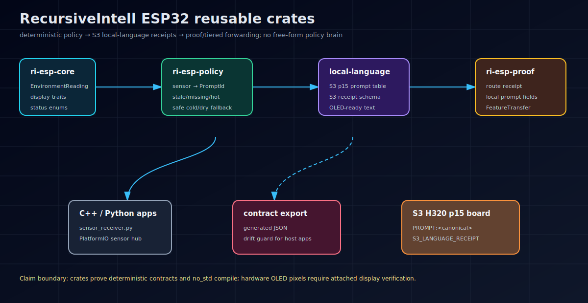

# ESP32 Reusable Crates

Reusable, no_std-first Rust crates distilled from RecursiveIntell ESP32/ESP32-S3 physical-AI experiments.



## What this gives you

This workspace turns one-off firmware work into small reusable crates:

- deterministic sensor policy instead of prompt-only behavior
- local-language receipt contracts for the ESP32-S3 H320 p15 status model
- proof receipts that say why a board stayed local or escalated
- fixed-capacity payloads for tiered ESP32 -> gateway/GPU forwarding
- embedded inference helpers that stay separate from product policy
- board/display utilities that avoid re-learning ESP32 pin and screen traps

## Crates

| crate | role |
|---|---|
| `ri-esp-core` | shared no_std readings, status enums, display/sensor traits |
| `ri-esp-board-profiles` | ESP32/S3 board constants and known-bad pin guardrails |
| `ri-esp-display` | HD44780+PCF8574 and ILI9341 display primitives |
| `ri-esp-llm` | int4, KV cache, RNN, sampling, compressed attention primitives |
| `ri-esp-tiered` | no_std fixed-capacity feature-transfer payloads |
| `ri-esp-policy` | deterministic sensor-state -> canonical PromptId policy |
| `ri-esp-local-language` | S3 p15 prompt/output and receipt contracts |
| `ri-esp-proof` | route/provenance receipts and policy-aware proof flow |

## Current sensor-policy flow

```text
EnvironmentReading
  -> ri-esp-policy: deterministic thresholds and PromptId
  -> ri-esp-local-language: canonical prompt/output + S3 receipt schema
  -> ri-esp-proof: provenance receipt with local_language_model/prompt
  -> host/firmware: OLED-ready text and optional AI escalation
```

The shared JSON contract for C++/Python consumers lives at:

`contracts/sensor_policy_s3_local_language_v1.json`

The sensor hub receiver now loads that contract instead of keeping a disconnected prompt table.

## Quick start

```toml
[dependencies]
ri-esp-core = "0.1"
ri-esp-policy = "0.1"
ri-esp-local-language = "0.1"
ri-esp-proof = "0.1"
```

```rust
use ri_esp_core::EnvironmentReading;
use ri_esp_policy::PolicyContext;
use ri_esp_proof::{ProofConfig, ProofEngine};

let sensor = EnvironmentReading::new(31.0, 70.0, None);
let ctx = PolicyContext::new(sensor, 3_000).with_last_read_ms(2_900);
let mut engine = ProofEngine::new(ProofConfig::default());
let receipt = engine.evaluate_with_policy("esp32-node", ctx, "gtx1070-local");

assert_eq!(receipt.local_language_prompt.as_str(), "high heat and humidity. action is ");
```

## Verification receipts

Local gates run 2026-07-01:

```bash
cargo test --workspace
cargo +esp check --target xtensa-esp32s3-none-elf -Z build-std=core,alloc --workspace --lib
python3 /home/sikmindz/projects/esp32-sensor-hub/tools/test_sensor_policy_s3_language.py --rounds 1 --timeout-s 5
```

Results:

- Rust workspace: 36 tests passed before contract export; contract-export test added afterward and included in final gates.
- ESP32-S3 no_std library check: passed.
- Python sensor-hub hard test without hardware S3: 9 policy cases, 9 static bridge cases, 9 HTTP cases passed.
- Previous hardware receipt: 24 real ESP32-S3 H320 p15 generations across 8 prompts passed. Source: `/home/sikmindz/projects/esp32-sensor-hub/sensor_policy_s3_hard_test_receipt.json`.

## Claim boundary

This workspace proves deterministic contracts and no_std compile/test behavior. It does not certify OLED physical pixels, safety-critical actuation, production maturity, or model quality outside the canonical prompt set.

## License

MIT OR Apache-2.0
