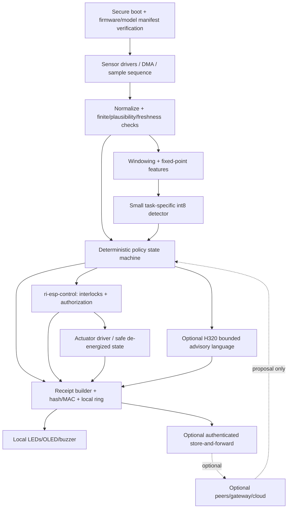

# Independent single-board ESP32-S3 Sentinel architecture

**Date:** 2026-07-15  
**Scope:** RecursiveIntell ESP32/ESP32-S3 crates, firmware, model artifacts, hardware receipts, research, and current external ESP32-S3 inference options.  
**Companion inventory:** [`ESP32S3_RESEARCH_INVENTORY_2026-07-15.json`](ESP32S3_RESEARCH_INVENTORY_2026-07-15.json)

## Executive verdict

The portfolio already proves that one ESP32-S3 can run a useful bounded H256/H320 char-LSTM locally. It does **not** yet contain one coherent production Sentinel firmware.

The best design is:

> One ESP32-S3 per physical endpoint owns sensing, input-quality checks, deterministic policy, action interlocks, local inference, persistent receipts, local UI, and recovery. The network is an optional asynchronous observer/escalation path. No model, state transition, or safety action depends on another board.

The recommended product profile is:

- **Hardware:** ESP32-S3 **N16R8 preferred**; N8R8 remains a supported minimum profile.
- **Control authority:** deterministic typed policy and `ri-esp-control`, never generated text.
- **Continuous AI:** a small task-specific int8 anomaly/classification model, or deterministic/HDC detector where that is sufficient.
- **Language:** event-driven **H320 p15** bounded status renderer; H256 is the speed profile after exact-output parity gates.
- **Runtime:** an ESP-IDF application shell for mature NVS, watchdog, OTA, secure boot, flash encryption, Wi-Fi, and rollback; Rust owns pure policy/protocol/receipt/control crates, while optimized C/C++ inference is exposed through a narrow C ABI.
- **Storage:** signed A/B firmware, signed model slots where flash allows, crash-safe receipt ring, persistent boot/event identity.
- **Communications:** authenticated store-and-forward events and locally re-evaluated command proposals. Offline loss never disables sensing, policy, safe actuation, display, or logging.

Do not make H512 or H768 continuous generation the product. Do not retain sharding in the default firmware.

---

## 1. Audit coverage and evidence quality

The programmatic inventory found:

- **14 ESP32-related Cargo manifests**, including all eight `ri-esp-*` crates.
- **137 authored research/evidence/configuration candidates** after excluding build output, vendored libraries, archive duplicates, and raw benchmark runs when a summary exists.
- **24 source model artifacts** (`.bin`, `.pt`, `.tflite`; no ONNX artifacts found).
- **45 candidate JSON contracts/receipts/summaries**, all syntactically valid; no explicit `passed:false`, `ok:false`, or `status:FAIL` fields were found. This is syntax/status inventory, not proof that every `passed:true` assertion is semantically justified.

Primary repositories examined:

| Repository | Current local HEAD | State during audit |
|---|---:|---|
| `esp32-reusable` | `3e2e710593c7` | clean before this report |
| `esp32-s3-lstm-proof` | `9183c810c9ef` | dirty: modified `platformio.ini`, untracked H512 receipts, H768 checkpoints, and `sdkconfig.defaults` |
| `esp32-sensor-hub` | `3f0268b03eb6` | generated receipt JSON/JSONL files modified |
| `esp32s3-edge-ai` | `e6e4e9f9f29b` | clean |
| `tiered-edge-ai` | `873ef9d10142` | clean |

Related non-repository experiment directories `dying-llm` and `dying-llm-esp32s3-i2c`, and Python training project `esp32-max-lm-training`, were also examined.

### Current verification run

| Gate | Result |
|---|---|
| `esp32-reusable`: `cargo test --workspace` | pass; 35 Rust tests observed |
| `esp32-reusable`: host `cargo check --workspace` | pass |
| `esp32-reusable`: Xtensa `cargo +esp check --target xtensa-esp32s3-none-elf -Z build-std=core,alloc --workspace --lib` | pass on 2026-07-15 |
| `tiered-edge-ai/bridge`: `cargo test` | pass; 4 tests |
| `tiered-edge-ai/esp32-s3`: embedded target check | pass |
| `esp32s3-edge-ai/edge-ai-starter`: release build | pass |
| `esp32-sensor-hub`: PlatformIO `esp32dev` | pass; 47,832 B RAM, 1,021,669 B flash |
| `esp32-sensor-hub`: PlatformIO `esp32s3` | pass; 46,940 B RAM, 983,749 B flash |
| Sensor policy/language host test | pass; 9 policy, 9 static bridge, 9 HTTP cases; no live S3 queries |
| `dying-llm-esp32s3-i2c`: Xtensa check | pass with warnings |
| `dying-llm`: attempted check | fail: project lacks/overrides the required embedded target configuration |
| New physical hardware run | **not run**; `/dev/ttyACM0` and `/dev/ttyUSB0` were absent on 2026-07-15 |

Historical hardware receipts remain evidence for the exact recorded firmware/model pairs, not evidence of what is currently flashed.

---

## 2. What the crates and projects actually contain

| Component | Verified implementation | Sentinel role |
|---|---|---|
| `ri-esp-core` | `no_std` environmental readings, four statuses, sensor/display traits | Keep; expand into timestamped, quality-bearing samples and device/boot identity. |
| `ri-esp-board-profiles` | two ESP32 profiles and one narrow S3 I²C/PSRAM pin guard | Keep; replace ad hoc constants with complete N8R8/N16R8 capability profiles. |
| `ri-esp-display` | blocking HD44780 and bit-banged ILI9341 primitives | Optional UI only; never in the control critical path. |
| `ri-esp-llm` | generic int4, KV-cache, compressed-attention, simple RNN and sampling helpers | It is not the proven LSTM runtime. Deprecate the ambiguous name and extract a real model runtime. |
| `ri-esp-policy` | threshold-to-`PromptId` routing with fixed confidence labels | Keep as pure policy, but make it fail closed and return typed decisions/actions rather than prompts alone. |
| `ri-esp-local-language` | canonical prompt/output lookup and in-memory receipt structs | Keep as contracts/fixtures. `static_passed()` is not production inference. |
| `ri-esp-proof` | in-memory route receipt construction, hand-built JSON, `FeatureTransfer` conversion | Evolve into a durable typed receipt crate with integrity, boot identity, persistence and explicit errors. |
| `ri-esp-tiered` | unversioned scalar-prediction codec | Replace/deprecate with one canonical, versioned `ri-esp-protocol`. |
| `esp32-s3-lstm-proof` | real RILM v1 parsing, multi-layer LSTM, PSRAM, int4/int8, dual-core and custom ESP-NN/SIMD path | Extract the model runtime; archive cluster modes from the product lane. |
| Tiered Rust Sentinel | MicroFlow `sine.tflite`, generated scalar inputs, synthetic confidence | Smoke fixture only. It does not invoke H256/H320/H512. |
| `edge-ai-starter` | hello-world and sine TFLite demo | Keep one minimal CI/target smoke fixture. |
| `esp32-sensor-hub` | real DHT/OLED/Wi-Fi/HTTP firmware and host receiver | Best current application integration reference; receiver/gateway must remain optional. |
| `esp32-max-lm-training` | H512 trainer exporting large Rust arrays rather than RILM | Consolidate exporters around one versioned model format. |
| `dying-llm*` | RNN/display experiments with duplicated generated weights/runtime code | Archive as demos; keep only unique display and lifecycle fixtures. |

Important source evidence:

- The reusable `ri-esp-llm` `rnn_step` is a simple single-state RNN, not the deployed multi-layer LSTM: [`crates/ri-esp-llm/src/rnn.rs:8`](../crates/ri-esp-llm/src/rnn.rs#L8).
- Tiered Wi-Fi firmware embeds the sine model: `/home/sikmindz/projects/tiered-edge-ai/esp32-s3/src/bin/sentinel_wifi.rs:48`.
- `ri-esp-local-language::static_passed()` sets `passed=true` from a lookup without inference: [`crates/ri-esp-local-language/src/lib.rs:47`](../crates/ri-esp-local-language/src/lib.rs#L47).
- The real model path is in the large experimental firmware: `/home/sikmindz/projects/esp32-s3-lstm-proof/src/main.cpp` around lines 1,850–2,300.

---

## 3. Severity-ranked findings

### Critical

#### C1. There is no enforceable model-to-actuator isolation boundary

`ri-esp-policy` returns a prompt, route bit and fixed confidence. The language layer returns imperative-looking strings such as `ventilate.` and `check airflow.`. No typed `AuthorizedAction`, interlock, safe-state transition, cooldown, acknowledgment or actuator trait makes generated text structurally incapable of causing action.

**Required change:** only `ri-esp-control` may construct `AuthorizedAction`. Model output type must be `AdvisoryText`, which no actuator API accepts.

#### C2. Update and credential security is not product-safe

The audit found committed plaintext Wi-Fi/service configuration in `esp32-sensor-hub/include/config.h`, default cluster/update credentials in `esp32-s3-lstm-proof/src/main.cpp`, and HTTP firmware/model update handlers without an adequate signed-manifest boundary.

**Required change:** rotate exposed credentials; remove secrets from tracked configuration; provision per-device secrets; require signed firmware and model manifests; enable Secure Boot v2, flash encryption, rollback protection and authenticated transport before an actuator-capable release. Do not record secret values in receipts.

#### C3. Model identity can disagree with compiled dimensions

Current `weights.bin` is the H320 artifact:

- 2,510,076 bytes
- SHA-256 `fb042c0aa011475e0a31d2c5d271dde57c504aa1bdcdb02ecd3ce0010ebf2b7a`

The default PlatformIO environment currently falls back to H256 constants. RILM tensor lookup validates names more strongly than full shape/schema identity, so a wrong model can reach inference instead of failing closed.

**Required change:** the build embeds a signed model manifest with architecture, dimensions, tensor schema, quantization, byte length and digest. Boot calculates the digest from loaded flash and rejects any mismatch before inference.

#### C4. Receipts cannot establish ordering or integrity across reboot

Rust and C++ event counters start in RAM. Current host JSONL appends do not provide crash-safe sequence allocation, torn-write recovery, hash chaining, authentication, duplicate rejection or replay protection.

**Required change:** persist `{device_id, boot_id, event_seq}`; use block-allocated sequence ranges; add CRC for damage detection and keyed MAC/signature for authenticity; include `previous_receipt_hash`; make upload idempotent.

### High

#### H1. Three wire formats use the same `TEAI` name

1. `ri-esp-tiered`: scalar prediction.
2. `tiered-edge-ai/bridge`: prediction count plus vector.
3. `sentinel_wifi.rs`: an outer `TEAI + length` frame containing another `TEAI` payload.

The bridge decoder also slices using untrusted counts without complete bounds checks.

**Required change:** one versioned protocol with a single owner, explicit total length, message type, device/boot/event identity, payload length, CRC/MAC and cross-language golden vectors. Gateway support is optional, but ambiguity is still a correctness/security defect.

#### H2. Policy defaults can normalize missing/malformed data

- Missing temperature/humidity under status `Ok` become 25°C/50%.
- Unknown operator prompt overrides become `NormalRoom` with confidence 1.0.
- `PolicyContext::new()` sets `last_read_ms=0`, creating a hidden freshness requirement.
- NaN/Inf and sensor plausibility are not rejected centrally.

**Required change:** constructors return `Result`; missing/non-finite/implausible inputs become typed degraded states; unknown overrides are rejected; freshness is part of `Sample<T>`, not an optional caller convention.

#### H3. Receipt strings can silently truncate and JSON escaping is incomplete

Fixed-capacity `push_str` errors are discarded. Hand-built JSON does not correctly escape arbitrary strings and rounds floats to one decimal place.

**Required change:** typed binary canonical encoding on-device (postcard/CBOR-style or a small fixed schema), explicit overflow errors, and JSON conversion only at the host boundary. Preserve raw quantized sensor values or declared precision.

#### H4. RILM v1 validation is not sufficient for hostile/corrupt input

Missing checks include strict version rejection, legal dtypes, finite/non-zero scales, exact shapes, duplicate tensor names, trailing bytes and calculated full-pack digest. Some shard parser paths have weaker bounds checks.

**Required change:** extract and fuzz a host-buildable parser before reusing the format in product firmware.

#### H5. `passed:true` is not consistently an acceptance result

Static lookup receipts set `passed=true` by construction. Firmware benchmark receipts can print `passed:true` without comparing output to a declared expected set. P22 is fast but differs from canonical outputs (`humid room` became `escalate`, and stale output shortened to `wait`).

**Required change:** separate `executed`, `transport_valid`, `numeric_parity`, `expected_output_match`, and `policy_safe` fields. A benchmark can execute successfully without passing product-language parity.

#### H6. Watchdogs are disabled in long model modes

Some local-generation and shard modes disable watchdogs to tolerate long work.

**Required change:** inference must be chunkable/preemptible; the control plane has an independent watchdog and deadline; a stuck model task cannot prevent sensor sampling or drive outputs indefinitely.

### Medium

- N8R8 board/pin knowledge is incomplete and board-specific assumptions are mixed. Exact module/devkit pin reservations must be generated from a named hardware profile; do not generalize a GPIO warning across S3 modules.
- `extra_script.py` mutates vendored ESP-NN source during builds, harming reproducibility.
- Most parser/watchdog tests are source-text guards rather than tests against executable parsers and malformed artifacts.
- Cluster, H768, sine, transformer, dying-LLM and duplicated training/export paths obscure the single-board production path.
- Historical benchmark claims are not always tied to the exact source digest of the dirty current tree.

---

## 4. Model evidence and the recommended use of AI

All local generation rates below are **character-generation steps per second** for char-level models. They are not native BPE token rates.

| Profile | Params / artifact | Verified single-board result | Product assessment |
|---|---:|---:|---|
| H256 p12 all-int8 | 1.596M / 1,614,972 B | 25.0653 chars/s; 39.90 ms/char | Fast useful baseline; retain as reference profile. |
| H256 p22 int4+SIMD | same source pack, packed at boot | 39.517 chars/s; 25.30 ms/char | Performance proof. Canonical-output drift means it is not the default product-language profile until parity gates pass. |
| **H320 p15 all-int8** | **2.486M / 2,510,076 B** | **17.229 chars/s; 58.04 ms/char** | **Recommended bounded language renderer.** All eight canonical stopped outputs matched the recorded product set. 16/32 characters are about 0.93/1.86 s. |
| H512 TinyStories-class mixed | 6.338M / 4,785,276 B | 11.6223 chars/s fixed benchmark; 86.04 ms/char | Research/demo only. It left ~2.08 MB PSRAM after boot conversion and provides no authority advantage. |
| H768 unsharded pack | 14,282,368 B | projected/research only | Does not fit the current N8R8 weights partition and is not a practical independent Sentinel profile. Archive from the product lane. |
| sine TFLite | 2,680 B | target builds | Smoke fixture only; not a Sentinel model. |

### Recommended two-stage AI plane

1. **Continuous detector:** run a small task-specific model over normalized feature windows.
   - Environmental: statistical detector, HDC memory, small int8 MLP, 1D CNN or tiny GRU.
   - Audio: ESP-SR WakeNet/MultiNet profile.
   - Vision: ESP-DL/TFLM/ESP-WHO profile.
   - Do not force one multimodal firmware image; use profile-specific Sentinels sharing the same control/receipt protocol.

2. **Event-driven local language:** invoke H320 only on a policy state transition, operator query, fault summary or slow periodic digest. Limit output to a fixed maximum, stop at punctuation, and label it advisory.

The deterministic plane should remain fully useful if the language model fails to load.

### Fresh external-runtime finding

Earlier local research described ESP-DL as not having a ready LSTM path. Current official `operator_support_state.md`, checked 2026-07-15, now lists **LSTM and GRU support for int8, int16 and float32**. ESP-DL also documents:

- `.espdl` FlatBuffers with zero-copy deserialization;
- a static internal-RAM/PSRAM memory planner;
- ONNX/PyTorch/TensorFlow quantization through ESP-PPQ;
- optimized Gemm/Conv/operators and 8-bit LUT activations;
- dual-core scheduling currently documented specifically for Conv2D and DepthwiseConv2D.

This creates a high-ROI comparison gate:

> Export the H256/H320 model to ONNX/`.espdl`, then compare ESP-DL LSTM against the custom RILM runtime on the same board, model, prompts and receipt schema.

Adopt ESP-DL if it preserves exact output and comes within the agreed latency/memory threshold; otherwise retain the custom runtime. Do not rewrite the proven runtime before this shootout.

---

## 5. Single-board Sentinel architecture



### Hard authority rules

1. Model output never enters an actuator parser.
2. Network and peer messages are `ActionProposal`, never `AuthorizedAction`.
3. Only local policy can authorize an action after re-reading current local state.
4. Stale, missing, non-finite, implausible or boot-uninitialized data fails closed.
5. Receipt/log failure does not block emergency transition to hardware safe state; it sets a visible degraded flag and retries persistence.
6. Language failure does not change the deterministic decision.
7. Network failure never stops local sensing, policy, control, UI or logging.

### Suggested task schedule

| Priority | Task | Deadline behavior |
|---:|---|---|
| Highest | sensor acquisition, emergency GPIO/interlock, control watchdog | bounded execution; no heap allocation; never waits for model/network/display |
| High | sample quality/freshness, deterministic policy, actuator authorization | fixed-capacity queues; fail closed on overflow |
| Medium | receipt commit and health monitor | append locally before optional upload; torn-write recovery |
| Low | task-specific inference | event/window budget; cooperative chunks; watchdog enabled |
| Lowest | H320 language, display rendering, networking, OTA checks | cancellable; cannot hold control locks |

On ESP-IDF, keep Wi-Fi/network services isolated from the control critical path. If model kernels use both cores, they must yield at defined chunks and remain preemptible by sensor/control deadlines.

### Independent behavior matrix

| Failure | Required local behavior |
|---|---|
| Wi-Fi/DNS/gateway/cloud loss | continue sensing, inference, policy, safe actuation, local UI and receipt ring |
| Peer loss | no effect except loss of optional corroboration |
| Model load/digest failure | deterministic-only degraded mode; no generative text |
| PSRAM failure/low memory | deterministic-only mode or tiny detector fallback; explicit receipt |
| Sensor disconnect/stuck value | transition to degraded/safe policy; never substitute normal defaults |
| Receipt partition full | overwrite only acknowledged/expired ring segment according to declared policy; expose degraded state |
| Brownout/reset | outputs de-energize; boot ID changes; persistent sequence resumes; recovery receipt emitted |
| Invalid remote action | reject locally with reason receipt |

---

## 6. Hardware, flash and memory profile

### Board recommendation

- **Preferred:** ESP32-S3 N16R8-class module: 16 MB flash, 8 MB octal PSRAM.
- **Minimum:** N8R8: 8 MB flash, 8 MB PSRAM.
- Confirm exact module, board routing, flash voltage/mode, PSRAM mode and unavailable GPIOs in a named compile-time profile.
- Add a hardware watchdog, brownout-safe output circuitry, local status LED/buzzer, and—where long offline retention is required—FRAM or microSD as an optional profile.

### Why N16R8 is preferred

The current N8R8 partition table consumes exactly the modeled 8 MiB budget:

- pre-app region: 64 KiB;
- two 1 MiB app slots;
- one 5 MiB model partition;
- 960 KiB SPIFFS;
- calculated slack: **0 bytes**.

That leaves no partition-layout margin for larger signed bootloader requirements, a second model slot, a dedicated receipt ring, or growth.

A concrete N16R8 H320 budget can reserve:

| Partition class | Size |
|---|---:|
| boot/table/NVS/OTA metadata allowance | 128 KiB |
| app A + app B | 2 MiB + 2 MiB |
| H320 model A + model B | 3 MiB + 3 MiB |
| receipt ring | 2 MiB |
| LittleFS/config/diagnostics | 1.5 MiB |
| Calculated total | 13.625 MiB |
| Remaining layout margin | 2.375 MiB |

Offsets must be generated and validated by the ESP-IDF partition tool; Secure Boot/flash-encryption bootloader growth must be included before eFuse provisioning.

### Memory placement

- **Internal SRAM:** stacks, ISR/control state, DMA descriptors, hot feature buffers, quantized hidden state, kernel scratch, interlock state.
- **PSRAM:** immutable/cold weights where zero-copy is unavailable, history windows, language state, network buffers, optional UI assets.
- **Flash-mapped model:** prefer validated zero-copy tensor views when kernel alignment and cache behavior permit.
- Do not clone every tensor by default. If an int8 tensor is replaced by a packed int4 tensor at boot, free the obsolete allocation.
- Record internal heap and PSRAM high-water marks in health receipts.

---

## 7. Crate consolidation proposal

### Keep and expand

#### `ri-esp-core`

Add:

```rust
Sample<T> {
    value: T,
    sampled_at_ticks: u64,
    sequence: u64,
    quality: SampleQuality,
}

DeviceIdentity { device_id, hardware_profile, boot_id }
```

`SampleQuality` should represent valid, missing, stale, non-finite, implausible, uncalibrated and sensor-fault states.

#### `ri-esp-board-profiles`

Own named N8R8/N16R8 profiles:

- flash/PSRAM size and mode;
- reserved GPIOs/strapping pins;
- safe exposed I²C/SPI/UART pins;
- partition/profile ID;
- sensors/displays/actuators;
- power and wake capabilities.

Build must fail if declared app/model partitions exceed the selected board.

#### `ri-esp-policy`

Return typed state and policy reason, not an implied action string. Make thresholds, hysteresis, cooldowns and stale limits a signed policy configuration. Remove fixed pseudo-probability confidence from deterministic rules; use `policy_certainty` or a typed reason instead.

#### `ri-esp-display`

Keep optional. Add clipping, delay abstraction, hardware-SPI path and fault isolation. Display failure cannot block control.

### Add

#### `ri-esp-control`

Sole owner of:

- `ActionProposal`;
- `AuthorizedAction` constructor privacy;
- interlocks, hysteresis, minimum on/off time and rate limits;
- manual override with expiry;
- actuator safe state and result receipts.

#### `ri-esp-model-runtime`

Own:

- strict RILM parser/validator and model manifest;
- `TensorView`, shape/dtype/scale validation and calculated digest;
- allocator/scratch interfaces;
- scalar reference kernels;
- custom ESP-NN/SIMD backend behind parity gates;
- optional ESP-DL backend;
- bounded multi-layer LSTM state/generation;
- C ABI: `model_open`, `model_verify`, `model_step`, `model_generate_bounded`.

#### `ri-esp-protocol`

Own one versioned frame/schema for Rust, C++ and Python. Deprecate `ri-esp-tiered` by re-exporting the new types during migration.

#### `ri-esp-receipt` or `ri-esp-proof` v2

Own typed receipt construction, canonical encoding, hash/MAC fields and storage traits. Keep transport optional and separate from receipt semantics.

### Restrict or archive

- Restrict `ri-esp-local-language` to prompt/output contracts and validation fixtures; remove production `static_passed()`.
- Rename/deprecate ambiguous `ri-esp-llm`; move reusable primitives under the model runtime or a clearly named primitives crate.
- Archive sharding/H768/default cluster firmware, duplicate dying-LLM runtimes and extra sine demos from the product build graph.
- Keep cluster research and receipts as historical evidence in a non-default `research/` or archive branch. Peers may exchange signed alerts, but never model shards.

---

## 8. Security and reliability baseline

Before an actuator-capable release:

1. Secure Boot v2 and flash encryption enabled together.
2. Signed A/B firmware with rollback and health confirmation.
3. Signed model manifests; calculated loaded-model digest; rollback to previous valid model.
4. Per-device identity and credentials; no shared/default update password.
5. Authenticated encrypted gateway transport; replay window keyed by boot/event ID.
6. DCP-inspired southbound invariants:
   - capability manifests;
   - units-as-types;
   - range/type checks;
   - dry-run evaluation;
   - explicit rejection receipts;
   - compact CBOR-like encoding and optional truncated HMAC where appropriate.
7. Independent hardware/control watchdog remains enabled during inference.
8. Brownout-safe, fixed-capacity queues with declared overflow policies.
9. Sensor plausibility, stuck-value, disconnect and stale transitions.
10. No remote command directly drives GPIO; all requests are re-evaluated by local policy.

Official Espressif documentation recommends flash encryption with Secure Boot, supports signed OTA verification, and provides rollback workflows. Security configuration must be proven on sacrificial development hardware before irreversible eFuse provisioning.

---

## 9. Implementation phases and binary gates

### Phase 0 — Contain current release blockers

**Outputs**

- rotate/remove committed credentials;
- disable unauthenticated update endpoints;
- make default firmware/model dimensions and hash agree;
- freeze sharding/H768 as non-default research profiles;
- preserve current dirty research tree before cleanup.

**Gate**

- no tracked secret scanner findings;
- wrong H256/H320/H512 pack fails before allocation/inference;
- default build contains no cluster/shard defines.

### Phase 1 — Typed control, protocol and receipts

**Outputs**

- `ri-esp-control`;
- `ri-esp-protocol` v1;
- receipt v2 with boot/event identity and explicit overflow errors;
- Rust/C++/Python golden vectors.

**Gate**

- generated/model/network text cannot compile as actuator input;
- malformed/truncated/oversized/replayed frames are rejected without panic;
- reboot/torn-write/ring-wrap tests preserve monotonic identity;
- every rejection emits a typed reason receipt.

### Phase 2 — Extract and compare model runtimes

**Outputs**

- host-buildable strict RILM parser;
- scalar reference LSTM;
- custom SIMD backend behind C ABI;
- ESP-DL H256/H320 export/comparison branch.

**Gate**

- PyTorch → exported model → scalar → custom SIMD/ESP-DL matches golden logits/tokens within declared tolerance;
- randomized aligned/unaligned/int4 lengths pass;
- H320 canonical output set is exact;
- model digest, dimensions and schema are calculated from loaded bytes;
- same-board receipts report latency, internal/PSRAM high-water marks and power conditions.

### Phase 3 — Compose one independent Sentinel firmware

**Outputs**

- ESP-IDF single-board app with sensor, quality, detector, policy, control, receipt, local UI and optional network tasks;
- H320 event-driven language profile;
- deterministic-only fallback.

**Gate**

- unplugging Wi-Fi/gateway/peers changes no local control result;
- model load failure enters deterministic-only mode;
- network proposal cannot bypass policy;
- watchdogs remain enabled through a 24-hour soak;
- sensor disconnect/stuck/NaN/stale tests fail closed.

### Phase 4 — Security, update and persistence closure

**Outputs**

- N16R8 production partition profile;
- signed A/B firmware and model update flow;
- authenticated receipt upload and replay rejection;
- power-loss recovery.

**Gate**

- unsigned firmware/model rejected;
- failed health check rolls back;
- interrupted receipt/model write recovers to last valid state;
- exact loaded firmware/model digests appear in hardware receipts;
- no plaintext secret in flash dump when flash encryption is enabled.

### Phase 5 — Hardware acceptance

**Gate**

- 24–72 hour sensor/Wi-Fi/model soak with watchdogs enabled;
- cold/warm boot and brownout tests;
- internal SRAM/PSRAM high-water and fragmentation receipts;
- power measurement by operating mode;
- actuator safe-state/chatter/cooldown/model-isolation tests;
- physical receipt identifies board SKU, firmware/model hashes, policy revision, sensor fixture and test equipment.

---

## 10. Current external research that materially changes the plan

| Source | Current finding | Impact |
|---|---|---|
| [ESP-DL](https://github.com/espressif/esp-dl) | Current source supports LSTM/GRU and offers zero-copy `.espdl`, static memory planning, ESP-PPQ/AutoQuant and optimized operators. | Run the H256/H320 vendor-runtime shootout before investing further in custom format/runtime expansion. |
| [ESP-NN](https://github.com/espressif/esp-nn) | S3 assembly kernels and large FC/vision speedups; reference/optimized variants are available. | Retain custom recurrent use only behind numeric/output parity gates. |
| [ESP-TFLite-Micro](https://github.com/espressif/esp-tflite-micro) | Mature ESP-IDF examples and ESP-NN integration; official table reports 54 ms S3 person detection for its fixture. | Good standard backend for supported perception models; not a reason to replace the proven language path automatically. |
| [MicroFlow](https://github.com/matteocarnelos/microflow-rs) | `no_std` Rust runtime; supported set is FC/Conv/Depthwise/AveragePool/Reshape plus ReLU/ReLU6/Softmax. | Keep for tiny Rust smoke/classifier profiles; it is not the current H320 LSTM backend. |
| [ESP-SR](https://docs.espressif.com/projects/esp-sr/en/latest/esp32s3/getting_started/readme.html) | ESP32-S3 AFE, wake word and command recognition stack. | Use a dedicated audio Sentinel profile rather than forcing audio through the char-LSTM. |
| [ESP-WHO](https://github.com/espressif/esp-who) | S3 vision/face framework and board support. | Use a dedicated vision profile with the common policy/control/receipt plane. |
| [Device Context Protocol, arXiv:2605.26159](https://arxiv.org/abs/2605.26159) | Capability scoping, range/type validation, units, dry-run, compact CBOR frames and optional HMAC. | Import southbound safety invariants; do not replace the stack wholesale. |
| [AutoMCU, arXiv:2605.21560](https://arxiv.org/abs/2605.21560) | Eliminates infeasible models using RAM/flash/toolchain feedback before training. | Build an `AutoESP` feasibility gate: board profile → model schema → partition/link/memory checks → smoke → train finalists. |
| [Atome-LM](https://github.com/TilelliLab/atome-lm) / [Cardputer AI](https://github.com/therezor/cardputer-ai) | Current public MCU text generation includes ternary/byte models and a claimed 8M Q4 S3 model. | Do not claim first/fastest/general superiority. Compare tokenizer-native steps, decoded chars, memory, task utility and evidence quality separately. |

GitHub metadata checked 2026-07-15 showed these projects active rather than archived; repository popularity is not used as proof of technical superiority.

---

## 11. Claim boundary

### Supported by current local evidence

- Hardware-receipted H256/H320/H512 char-LSTM execution on an ESP32-S3 Freenove WROOM N8R8 for the recorded firmware/model pairs.
- H320 p15 produced the eight recorded bounded canonical status outputs at 17.229 character steps/s.
- H512 TinyStories-class 6.34M char-LSTM ran locally at 11.6223 character steps/s in the fixed benchmark. It is not TinyStories-33M.
- The reusable Rust workspace currently passes host tests/checks and an Xtensa `no_std` library check.
- Sensor-hub builds for ESP32 and ESP32-S3 and passes the current no-hardware policy/language harness.

### Not established

- Production-safe autonomous actuation.
- Current secure boot, flash encryption, rollback or eFuse state.
- What firmware/model is presently flashed; no S3 serial device was attached during this audit.
- General-purpose language ability.
- Fastest ESP32-S3 language model overall.
- BPE tokens/s for the char-level models; conversions remain estimates.
- H768 single-board feasibility or utility.
- Current dirty-tree benchmark equivalence to older source/firmware receipts.

---

## 12. Open hardware/workload assumptions

The design is valid as a framework, but these product choices must be fixed per Sentinel profile:

- exact module/devkit and flash/PSRAM mode;
- sensors, sample rates, calibration and plausibility bounds;
- whether the unit only reports or also actuates;
- actuator safe polarity and independent electrical interlock;
- maximum event latency and average/peak power;
- required offline receipt retention;
- whether UTC is available or only monotonic time;
- required update and physical-tamper threat model;
- whether Wi-Fi/BLE must remain active during inference;
- environmental, audio or vision primary workload;
- false-positive/false-negative cost and held-out evaluation set.

These should become named, signed hardware/application profiles rather than scattered compile-time constants.

---

## Bottom line

Stop optimizing distributed generation for the product path. Extract the proven single-board model runtime, put it behind strict model verification, add a typed deterministic control boundary, make receipts durable, and compose one ESP-IDF Sentinel that remains fully useful with its radio unplugged.

For the first product-quality unit, use **N16R8 + a small continuous detector + deterministic policy/control + event-driven H320 p15 + persistent authenticated receipts**. Keep H256 as the performance option, H512 as a research/demo profile, and sharding/H768 as archived evidence rather than operational dependencies.
